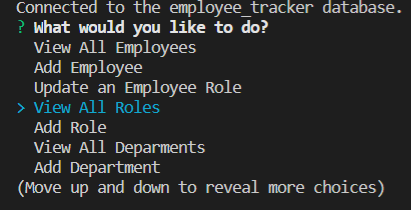

# SQL Challenge: Employee Tracker

## Description

This project is a command line application that gives the user access to a database for tracking employee information. This application can be useful to business owners or managers with many employees to organize.

## Table of Contents
- [Description](#description)
- [Installation](#installation)
- [Usage](#usage)
- [License](#license)
- [Questions](#questions)

## Installation

To install the app a user needs to install node.js and run “npm install” from the cloned repository.

## Usage

To use the app a user needs to run “node index.js” from the cloned repository. The user will be prompted with a set of choices to view or add departments, roles and employees. When the user makes a choice they are either shown the information requested or put through the steps to add data. The user is always navidated back to the original set of choices and when they are done, selecting quit will exit the application. A video walkthrough can be found at [video walkthrough.](https://drive.google.com/file/d/12DPuDHrt1fEYw3dY8cHEiVlAwT0i8plB/view) 

A screenshot of the prompts.

## License

This project is under the MIT license at [MIT](https://opensource.org/licenses/MIT)

## Questions

If you have additional questions please feel free to reach out.

Github: https://www.github.com/abdallajama201

